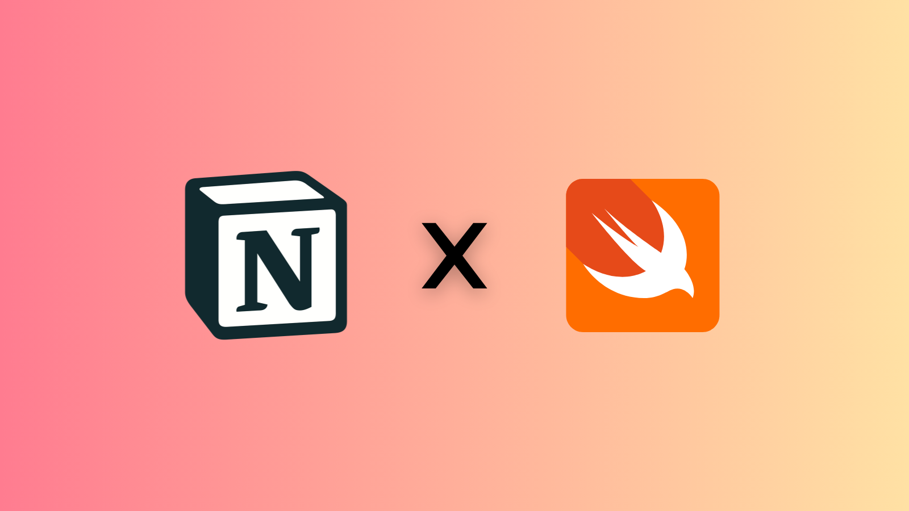

# ``NotionKit``

[](https://github.com/elvisperlika/notion-kit/actions)




Unofficial iOS/macOS SDK for the Notion API.

## Overview

This SDK provides a Swift interface to interact with the Notion API.

This SDK is update on Notion API "**2025-09-03**" with baseURL `https://api.notion.com/v1`.

## Setup

This SDK requires a [Notion Integration](https://www.notion.so/my-integrations).

1. Create a new integration in Notion.  
2. Copy the **Integration Key**.  
3. Save it as an environment variable in your codebase:

    ```swift
    NOTION_TOKEN=your_integration_key_here
    ```

4. Add the SDK to your project:

    ```swift
    .package(url: "https://github.com/elvisperlika/notion-kit", from: "1.0.0")
    ```
  
5. Create your Notion Client with the API key:

    ```swift
    guard let apiKey: String = ProcessInfo.processInfo.environment["NOTION_TOKEN"] else {
      fatalError("Missing NOTION_TOKEN environment variable")
    }
    let client = try NotionClient(apiKey: apiKey)
    ```

## Guide

Note: this SDK requires a Notion Integration.
Create an integration in Notion, copy its key,
and save it as an environment variable in your codebase.
Keep in mind that the integration can only access
pages or databases you have manually shared with it.

### Users

To get the list of users in your Notion workspace, use the following code:

```swift
let users: [NotionUser]? = try await client?.users()
```

Filter by user type:

- **`bots`**: Get only bot users.

  ```swift
  let bots: [NotionUser]? = try await client?.users().bots()
  ```

- **`persons`**: Get only person users.

  ```swift
  let persons: [NotionUser]? = try await client?.users().persons()
  ```

Get the current user (the integration itself):

```swift
let me: NotionUser? = try await client?.me()
```

Get a user by their ID:

```swift
let userId: String = "user_id_here"
let user = try await client?.user(id: userId)
```

### Search

Get all pages shared with the integration:

```swift
/// Get all pages shared with the integration
let pages = try await client?.search().results
```

It's possible to pass some parameters to filter the results:

- **`query`**: A string to search for in page and database titles.
- **`filter`**: An optional ``SearchFilter`` to filter results by object type.
  - Possible values for `SearchFilter.value` are `.page` or `.database`.
  - Possible values for `SearchFilter.property` is `.object`.
- **`sort`**: An optional ``SearchSort`` to sort results by last edited time.
  - Possible values for `SearchSort.direction` are `.ascending` or `.descending`.
  - Possible values for `SearchSort.timestamp` is `.lastEditedTime`.
- **`startCursor`**: An optional string representing the cursor for pagination.
- **`pageSize`**: An optional integer representing the number of results to return per page.

#### Pagination

The search method supports pagination through the `startCursor` and `pageSize` parameters.

```swift
let firstResponse = try await client?.search(pageSize: 10)
let pages = firstResponse?.results
if let nextCursor = firstResponse?.nextCursor {
    let secondResponse = try await client?.search(startCursor: nextCursor, pageSize: 10)
    let otherPages = secondResponse?.results
}
```

To have a more convenient way to handle pagination, you can use the
``SearchPaginator`` helper:

```swift
let paginator = SearchPaginator(client: client!, size: 5)
/// Default page size is 10, but you can customize it.
let response = try await paginator.nextResponse()
let nextResponse = try await paginator.nextResponse()
let nextNextResponse = try await paginator.nextResponse()
```

Do you want to fetch all pages at once? Use the
``fetchAllPages()`` method (it will handle pagination for you):

```swift
let paginator = SearchPaginator(client: client!)
let allPages = try await paginator.fetchAllPages()
```
