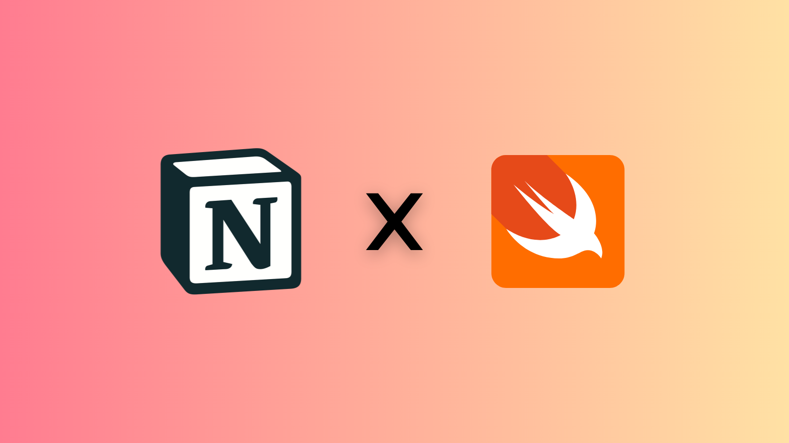

# ``Alexis``



Unofficial iOS/macOS SDK for the Notion API.

## Overview

This SDK provides a Swift interface to interact with the Notion API.

## Setup

This SDK requires a [Notion Integration](https://www.notion.so/my-integrations).

1. Create a new integration in Notion.  
2. Copy the **Integration Key**.  
3. Save it as an environment variable in your codebase:

    ```swift
    NOTION_TOKEN=your_integration_key_here
    ```

4. Add the SDK to your project:

- url: "https://github.com/elvisperlika/alexis.git"
- version: "1.0.0"

1. Create your Notion Client with the API key:

    ```swift
    guard let apiKey: String = ProcessInfo.processInfo.environment["NOTION_TOKEN"] else {
      fatalError("Missing NOTION_TOKEN environment variable")
    }
    let client = try NotionClient(apiKey: apiKey)
    ```

## Guide

Note: this SDK requires a Notion Integration.
Create an integration in Notion, copy its key,
and save it as an environment variable in your codebase.
Keep in mind that the integration can only access
pages or databases you have manually shared with it.

### Workspace's users

To get the list of users in your Notion workspace, use the following code:

```swift
let users: [NotionUser]? = try await client?.fetchUsers()
```

Filter by user type:

```swift
/// Get only bots
let bots: [NotionUser]? = try await client?.fetchUsers().bots()

/// Get only persons
let persons: [NotionUser]? = try await client?.fetchUsers().persons()
```

### Pages

Get all pages shared with the integration:

```swift
let pages = try await client?.fetchPages()
```

### Databases
